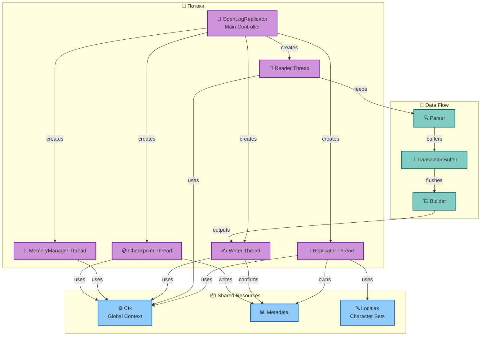
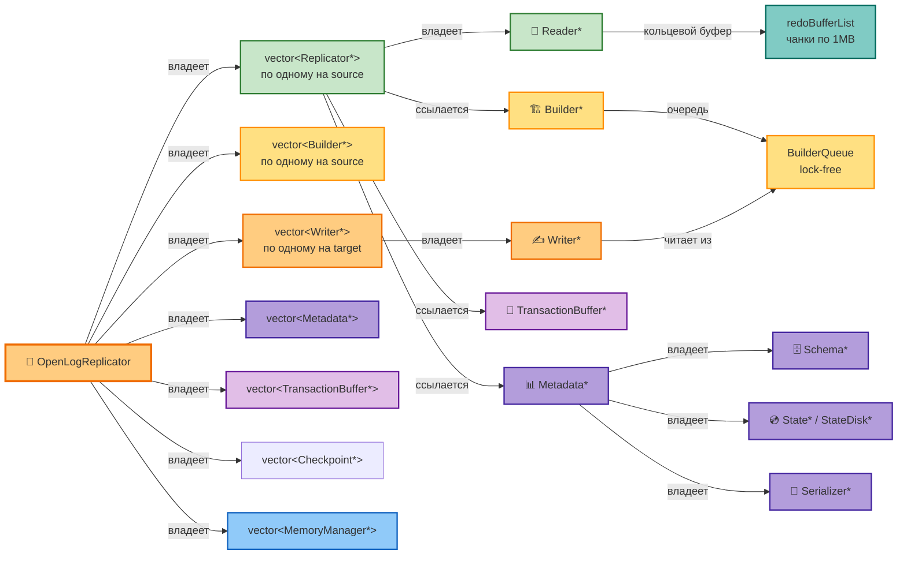
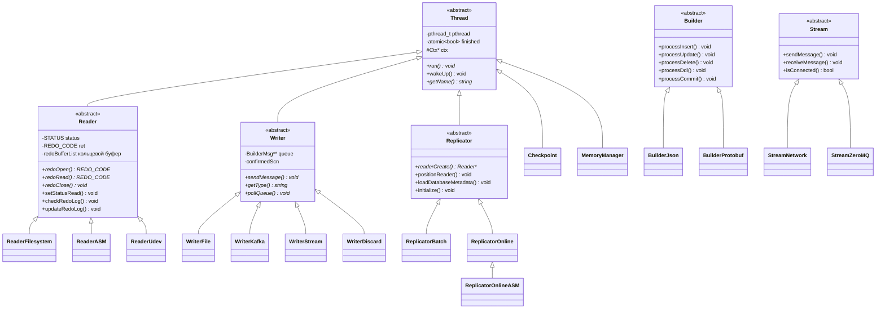

# Архитектура компонентов OpenLogReplicator

## Общая схема компонентов

```mermaid
graph TB
    subgraph Entry["🚀 Точка входа"]
        main["main()"]
        OLR["OpenLogReplicator<br/>Оркестратор: парсинг конфига,<br/>создание и связывание компонентов"]
    end

    main --> OLR

    subgraph Core["⚙️ Инфраструктура"]
        Ctx["Ctx<br/>Глобальный контекст<br/>Логирование, память, конфиг, endianness"]
        Thread["Thread<br/>Базовый класс потока (pthread)"]
        MM["MemoryManager<br/>Thread: swap/unswap<br/>памяти транзакций на диск"]
        Exc["Исключения<br/>Boot / Configuration / Data<br/>Network / RedoLog / Runtime"]
    end

    OLR --> Ctx
    Thread --> Ctx
    MM --> Ctx

    subgraph Replication["🔄 Слой репликации (Thread)"]
        Rep["Replicator (abstract)<br/>Координация Reader + Parser + Builder"]
        RepBatch["ReplicatorBatch (final)<br/>Архивные логи с ФС"]
        RepOnline["ReplicatorOnline<br/>Online через OCI"]
        RepOnlineASM["ReplicatorOnlineASM (final)<br/>ASM: OCI + dbms_diskgroup<br/>или udev блочные устройства"]
    end

    OLR --> Rep
    Rep --> RepBatch
    Rep --> RepOnline
    RepOnline --> RepOnlineASM

    subgraph Readers["📖 Слой чтения (Thread)"]
        Reader["Reader (abstract)<br/>redoOpen/Read/Close"]
        RF["ReaderFilesystem (final)<br/>pread() с ФС<br/>O_DIRECT / F_NOCACHE"]
        RASM["ReaderASM (final)<br/>OCI + dbms_diskgroup<br/>.open/.read/.close"]
        RUdev["ReaderUdev (final)<br/>pread() с блочных устройств<br/>extent map из x$kffxp"]
    end

    Rep --> Reader
    Reader --> RF
    Reader --> RASM
    Reader --> RUdev

    subgraph Parsing["🔍 Слой парсинга"]
        Parser["Parser (final)<br/>Парсинг redo записей,<br/>группировка в транзакции"]
        OpCode["OpCode<br/>Обработчики Redo записей<br/>0501-1A06"]
        Txn["Transaction (final)<br/>Транзакция Oracle (Xid,<br/>begin/commit SCN, записи)"]
        TxnBuf["TransactionBuffer<br/>Буфер активных транзакций<br/>unordered_map Xid→Transaction"]
    end

    Rep --> Parser
    Parser --> OpCode
    Parser --> TxnBuf
    TxnBuf --> Txn

    subgraph Building["🏗️ Слой построения сообщений"]
        Builder["Builder (abstract)<br/>processInsert/Update/Delete/Ddl/Commit"]
        BJson["BuilderJson (final)<br/>JSON вывод"]
        BPB["BuilderProtobuf (final)<br/>Protobuf вывод"]
        SysTxn["SystemTransaction<br/>Обработка DDL системных таблиц,<br/>обновление Schema на лету"]
    end

    Parser --> Builder
    Builder --> BJson
    Builder --> BPB
    Builder --> SysTxn

    subgraph Writing["✍️ Слой записи (Thread)"]
        Writer["Writer (abstract)<br/>sendMessage()"]
        WFile["WriterFile (final)<br/>Файл / stdout<br/>Ротация: NUM/TIMESTAMP/SEQ"]
        WKafka["WriterKafka (final)<br/>Apache Kafka (librdkafka)"]
        WStream["WriterStream (final)<br/>Сетевой стрим (Protobuf)"]
        WDiscard["WriterDiscard (final)<br/>Пустой (тест/бенчмарк)"]
    end

    Builder --> Writer
    Writer --> WFile
    Writer --> WKafka
    Writer --> WStream
    Writer --> WDiscard

    subgraph Streaming["🌐 Транспорт (Stream)"]
        Stream["Stream (abstract)<br/>send/receiveMessage"]
        SNet["StreamNetwork (final)<br/>TCP сокет"]
        SZMQ["StreamZeroMQ (final)<br/>ZeroMQ сокет"]
    end

    WStream --> Stream
    Stream --> SNet
    Stream --> SZMQ

    subgraph MetadataLayer["📊 Слой метаданных"]
        Metadata["Metadata<br/>READY → STARTING → REPLICATING"]
        Schema["Schema<br/>Словарь таблиц/колонок/LOB<br/>TablePack SysCol/SysTab/SysObj..."]
        Checkpoint["Checkpoint (Thread)<br/>Периодическое сохранение<br/>на диск + hot-reload конфига"]
        State["State / StateDisk<br/>Хранение .json на диске"]
        Serializer["SerializerJson<br/>Сериализация схемы"]
    end

    OLR --> Metadata
    Metadata --> Schema
    Metadata --> Checkpoint
    Metadata --> State
    Metadata --> Serializer
    Rep --> Metadata

    subgraph LocalesLayer["🔤 Кодировки"]
        Locales["CharacterSet<br/>AL32UTF8, JA16SJIS,<br/>ZHS16GBK, CL8MSWIN1251..."]
    end

    Builder --> Locales

    subgraph DBConn["🗄️ Подключение к БД (OCI)"]
        DBEnv["DatabaseEnvironment"]
        DBCon["DatabaseConnection"]
        DBStmt["DatabaseStatement"]
    end

    RepOnline --> DBCon
    RepOnlineASM --> DBCon
    DBCon --> DBEnv
    DBCon --> DBStmt

    classDef abstract fill:#ffe082,stroke:#ff8f00,stroke-width:3px,stroke-dasharray: 5 5
    classDef final fill:#a5d6a7,stroke:#2e7d32,stroke-width:2px
    classDef infra fill:#90caf9,stroke:#1565c0,stroke-width:2px
    classDef thread fill:#ce93d8,stroke:#6a1b9a,stroke-width:2px
    classDef entry fill:#ffcc80,stroke:#ef6c00,stroke-width:3px
    classDef parsing fill:#80cbc4,stroke:#00695c,stroke-width:2px
    classDef metadata fill:#b39ddb,stroke:#4527a0,stroke-width:2px
    classDef locale fill:#c5e1a5,stroke:#558b2f,stroke-width:2px
    classDef dbconn fill:#ef9a9a,stroke:#c62828,stroke-width:2px

    class Rep,Reader,Builder,Writer,Stream abstract
    class RepBatch,RepOnlineASM,RF,RASM,RUdev,BJson,BPB,WFile,WKafka,WStream,WDiscard,SNet,SZMQ final
    class Ctx,Thread,MM,Exc,DBEnv,DBCon,DBStmt infra
    class Checkpoint,Metadata thread
    class main,OLR entry
    class Parser,OpCode,Txn,TxnBuf parsing
    class Schema,State,Serializer metadata
    class Locales locale
    class DBEnv,DBCon,DBStmt dbconn
```

## Взаимодействие и владение

### Потоки и данные

### Владение компонентами

## Иерархия наследования

## Условная компиляция

| Флаг CMake        | Включает                                                                                               |
|-------------------|--------------------------------------------------------------------------------------------------------|
| `WITH_OCI`        | DatabaseConnection/Environment/Statement, ReplicatorOnline, ReplicatorOnlineASM, ReaderASM, ReaderUdev |
| `WITH_RDKAFKA`    | WriterKafka                                                                                            |
| `WITH_PROTOBUF`   | BuilderProtobuf, WriterStream, StreamNetwork, StreamClient (отдельный бинарник), OraProtoBuf.pb        |
| `WITH_ZEROMQ`     | StreamZeroMQ (требует WITH_PROTOBUF)                                                                   |
| `WITH_PROMETHEUS` | MetricsPrometheus                                                                                      |
| `THREAD_INFO`     | Детальная статистика переключений контекста потоков                                                    |

## Выбор Reader в зависимости от режима

| Режим (reader type) | Класс Replicator                   | Online (group > 0) | Архив (group == 0)            |
|---------------------|------------------------------------|--------------------|-------------------------------|
| `batch` / `offline` | ReplicatorBatch                    | ReaderFilesystem   | ReaderFilesystem              |
| `online`            | ReplicatorOnline                   | ReaderFilesystem   | ReaderFilesystem              |
| `asm`               | ReplicatorOnlineASM                | ReaderASM          | ReaderFilesystem / ReaderASM  |
| `asm-udev`          | ReplicatorOnlineASM (useUdev=true) | ReaderUdev         | ReaderFilesystem / ReaderUdev |
