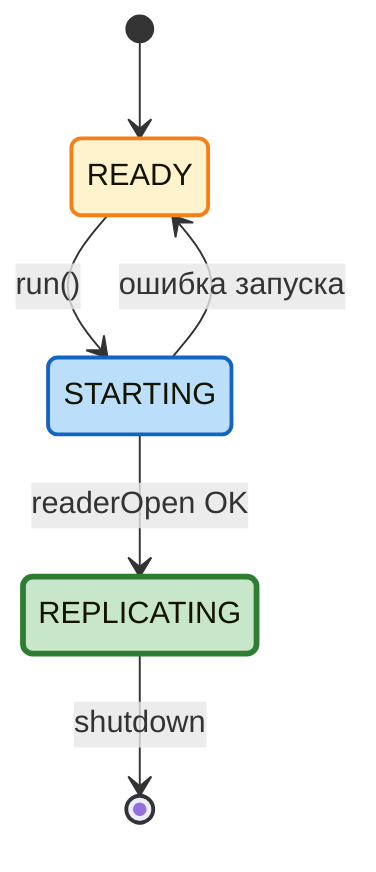
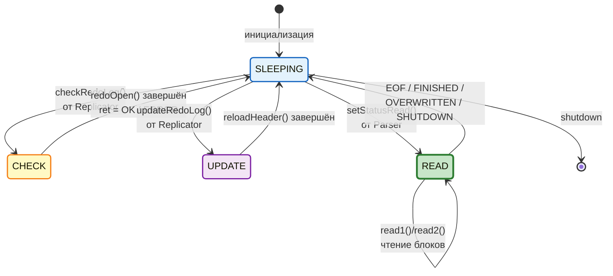
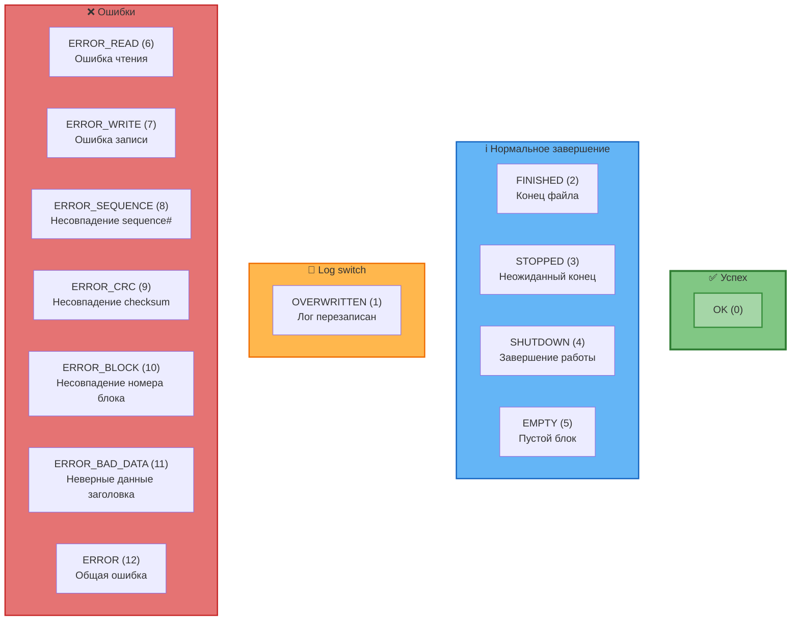
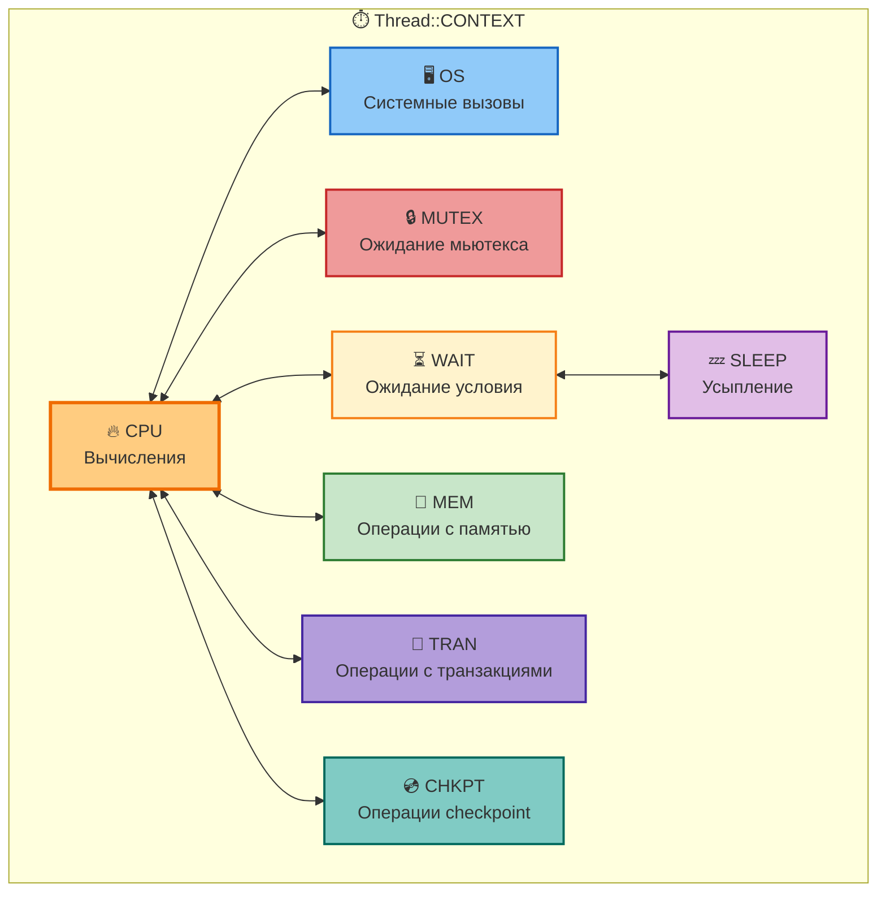
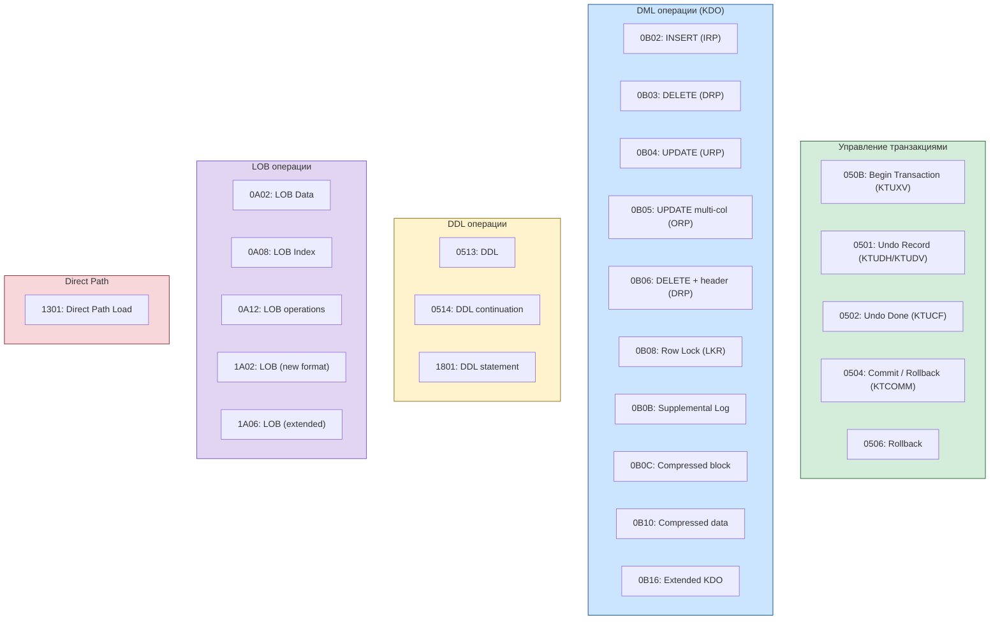
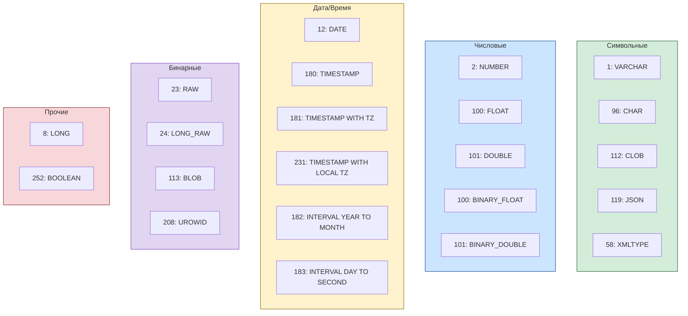
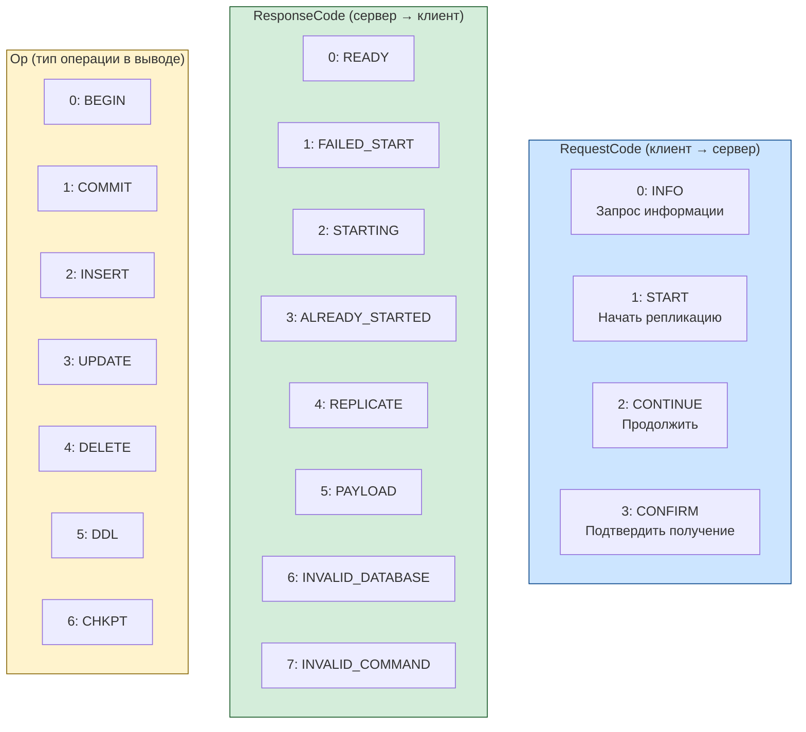
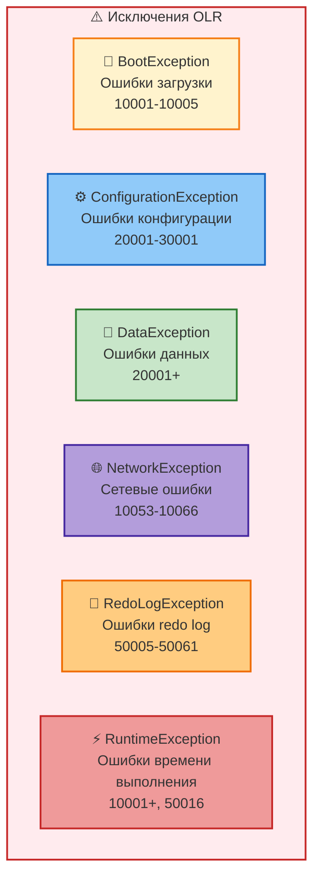

# Константы и состояния OpenLogReplicator

## Состояния Metadata (репликация)

## Состояния Reader (поток чтения)

## Результаты чтения Reader (REDO_CODE)

## Контексты потока Thread (профилирование)

## Типы операций Oracle Redo (OpCode)

## Флаги Row (RedoLogRecord::FB_*)

```mermaid
graph LR
    subgraph RowFlags["🏷️ Флаги строки (byte)"]
        FBN["FB_N 0x01<br/>NULL"]
        FBP["FB_P 0x02<br/>Piece"]
        FBL["FB_L 0x04<br/>Last piece"]
        FBF["FB_F 0x08<br/>First piece"]
        FBD["FB_D 0x10<br/>Deleted"]
        FBH["FB_H 0x20<br/>Head piece"]
        FBC["FB_C 0x40<br/>Cluster key"]
        FBK["FB_K 0x80<br/>Row continues"]
    end

    classDef flag_null fill:#e3f2fd,stroke:#1565c0,stroke-width:2px
    classDef flag_piece fill:#fff3cd,stroke:#f57f17,stroke-width:2px
    classDef flag_last fill:#c8e6c9,stroke:#2e7d32,stroke-width:2px
    classDef flag_first fill:#ffcc80,stroke:#ef6c00,stroke-width:2px
    classDef flag_del fill:#ef9a9a,stroke:#c62828,stroke-width:2px
    classDef flag_head fill:#e1bee7,stroke:#6a1b9a,stroke-width:2px
    classDef flag_cluster fill:#b2dfdb,stroke:#00695c,stroke-width:2px
    classDef flag_cont fill:#bbdefb,stroke:#1565c0,stroke-width:2px

    class FBN flag_null
    class FBP flag_piece
    class FBL flag_last
    class FBF flag_first
    class FBD flag_del
    class FBH flag_head
    class FBC flag_cluster
    class FBK flag_cont
```

## Версии Oracle Redo

| Константа           | Значение     | Версия      |
|---------------------|--------------|-------------|
| `REDO_VERSION_12_1` | `0x0C100000` | Oracle 12.1 |
| `REDO_VERSION_12_2` | `0x0C200000` | Oracle 12.2 |
| `REDO_VERSION_18_0` | `0x12000000` | Oracle 18c  |
| `REDO_VERSION_19_0` | `0x13000000` | Oracle 19c  |
| `REDO_VERSION_23_0` | `0x17000000` | Oracle 23c  |

## Типы колонок Oracle (SysCol::COLTYPE)

## Формат вывода: параметры Format

```mermaid
graph TB
    subgraph FormatConfig["Format — конфигурация вывода"]
        direction TB
        DB_FMT["DB_FORMAT<br/>DEFAULT | ADD_DML | ADD_DDL | ALL"]
        TS_FMT["TIMESTAMP_FORMAT<br/>UNIX_NANO/MICRO/MILLI<br/>ISO8601 (16 вариантов)"]
        SCN_FMT["SCN_FORMAT<br/>NUMERIC | TEXT_HEX"]
        SCN_TYPE["SCN_TYPE (битовая маска)<br/>COMMIT_VALUE | BEGIN | DML<br/>COMMIT | DEBEZIUM"]
        XID_FMT["XID_FORMAT<br/>TEXT_HEX | TEXT_DEC |<br/>NUMERIC | TEXT_REVERSED"]
        CHAR_FMT["CHAR_FORMAT<br/>UTF8 | NOMAPPING | HEX"]
        COL_FMT["COLUMN_FORMAT<br/>CHANGED | FULL_INS_DEC | FULL_UPD"]
        SCHEMA_FMT["SCHEMA_FORMAT<br/>FULL | REPEATED | OBJ"]
        RID_FMT["RID_FORMAT<br/>SKIP | TEXT"]
        MSG_FMT["MESSAGE_FORMAT (битовая маска)<br/>FULL | ADD_SEQUENCES |<br/>SKIP_BEGIN | SKIP_COMMIT | ADD_OFFSET"]
        UNK_TYPE["UNKNOWN_TYPE<br/>HIDE | SHOW"]
        USER_TYPE["USER_TYPE (битовая маска)<br/>BEGIN | DML | COMMIT | DDL | DEBEZIUM"]
    end
```

## Протокол WriterStream (коды)

## Ключевые константы

### Ctx (инфраструктура)

| Константа             | Значение         | Описание                      |
|-----------------------|------------------|-------------------------------|
| `MEMORY_CHUNK_SIZE`   | 1,048,576 (1 MB) | Размер чанка памяти           |
| `MEMORY_CHUNK_MIN_MB` | 32               | Минимальный размер памяти     |
| `MIN_BLOCK_SIZE`      | 512              | Минимальный размер блока redo |
| `MEMORY_ALIGNMENT`    | 4,096            | Выравнивание памяти           |
| `COLUMN_LIMIT`        | 1,000            | Лимит колонок Oracle < 23     |
| `COLUMN_LIMIT_23_0`   | 4,096            | Лимит колонок Oracle 23+      |

### Reader

| Константа              | Значение | Описание                          |
|------------------------|----------|-----------------------------------|
| `PAGE_SIZE_MAX`        | 4,096    | Макс. размер страницы (заголовок) |
| `BAD_CDC_MAX_CNT`      | 20       | Макс. повторных проверок CRC      |
| `FLAGS_END`            | 0x0008   | End-of-redo stream                |
| `FLAGS_ASYNC`          | 0x0100   | Асинхронная передача арх. лога    |
| `FLAGS_NODATALOSS`     | 0x0200   | No data-loss mode                 |
| `FLAGS_RESYNC`         | 0x0800   | Режим ресинхронизации             |
| `FLAGS_CLOSEDTHREAD`   | 0x1000   | Закрытый поток архивирования      |
| `FLAGS_MAXPERFORMANCE` | 0x2000   | Max performance mode              |

### ReaderUdev

| Константа       | Значение        | Описание                                |
|-----------------|-----------------|-----------------------------------------|
| `MAX_READ_SIZE` | 4 * 1024 * 1024 | Макс. размер чтения (4 MB)              |
| `MAGIC_XOR`     | 0x000081a0      | XOR-магия для исправления заголовка ASM |

### Builder

| Константа          | Значение             | Описание                    |
|--------------------|----------------------|-----------------------------|
| `VALUE_BUFFER_MIN` | 1,048,576 (1 MB)     | Минимальный буфер значений  |
| `VALUE_BUFFER_MAX` | 4,294,967,296 (4 GB) | Максимальный буфер значений |

### Parser

| Константа            | Значение                    | Описание            |
|----------------------|-----------------------------|---------------------|
| `MAX_LWN_CHUNKS`     | 1024 / MEMORY_CHUNK_SIZE_MB | Макс. чанков LWN    |
| `MAX_RECORDS_IN_LWN` | 1,048,576                   | Макс. записей в LWN |

## Конфигурационные параметры по умолчанию

| Параметр               | По умолчанию | Описание                         |
|------------------------|--------------|----------------------------------|
| `checkpointIntervalS`  | 600          | Интервал чекпоинтов (секунды)    |
| `checkpointIntervalMb` | 500          | Интервал чекпоинтов (МБ)         |
| `checkpointKeep`       | 100          | Количество хранимых чекпоинтов   |
| `redoReadSleepUs`      | 50,000       | Задержка чтения redo (мкс)       |
| `redoVerifyDelayUs`    | 0            | Задержка верификации redo (мкс)  |
| `archReadSleepUs`      | 10,000,000   | Задержка чтения арх. логов (мкс) |
| `refreshIntervalUs`    | 10,000,000   | Интервал обновления (мкс)        |
| `pollIntervalUs`       | 100,000      | Интервал опроса writer (мкс)     |
| `queueSize`            | 65,536       | Размер очереди writer            |
| `archReadTries`        | 10           | Попыток чтения арх. логов        |
| `logLevel`             | INFO         | Уровень логирования              |
| `stopLogSwitches`      | 0            | Остановить после N log switches  |
| `stopCheckpoints`      | 0            | Остановить после N checkpoint    |
| `stopTransactions`     | 0            | Остановить после N транзакций    |

## Иерархия исключений

## Типы данных Oracle (typedef)

| Тип              | Базовый тип | Описание              |
|------------------|-------------|-----------------------|
| `typeResetlogs`  | uint32_t    | Resetlogs ID          |
| `typeActivation` | uint32_t    | Activation ID         |
| `typeDbId`       | uint32_t    | Database ID           |
| `typeConId`      | int16_t     | Container ID          |
| `typeUba`        | uint64_t    | Undo Block Address    |
| `typeUsn`        | int16_t     | Undo Segment Number   |
| `typeSlt`        | uint16_t    | Slot (транзакции)     |
| `typeSqn`        | uint32_t    | Sequence (транзакции) |
| `typeAfn`        | uint16_t    | Absolute File Number  |
| `typeDba`        | uint32_t    | Data Block Address    |
| `typeObj`        | uint32_t    | Object ID             |
| `typeDataObj`    | uint32_t    | Data Object ID        |
| `typeCol`        | int16_t     | Column Number         |
| `typeTs`         | uint32_t    | Tablespace Number     |
| `typeUser`       | uint32_t    | User ID               |
| `XidMap`         | uint64_t    | Key мапы транзакций   |
| `time_ut`        | int64_t     | Время (мкс)           |
