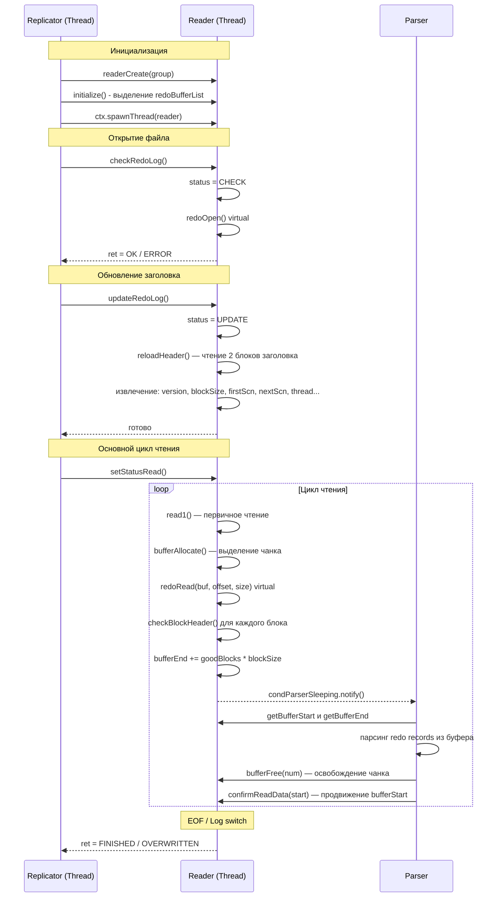
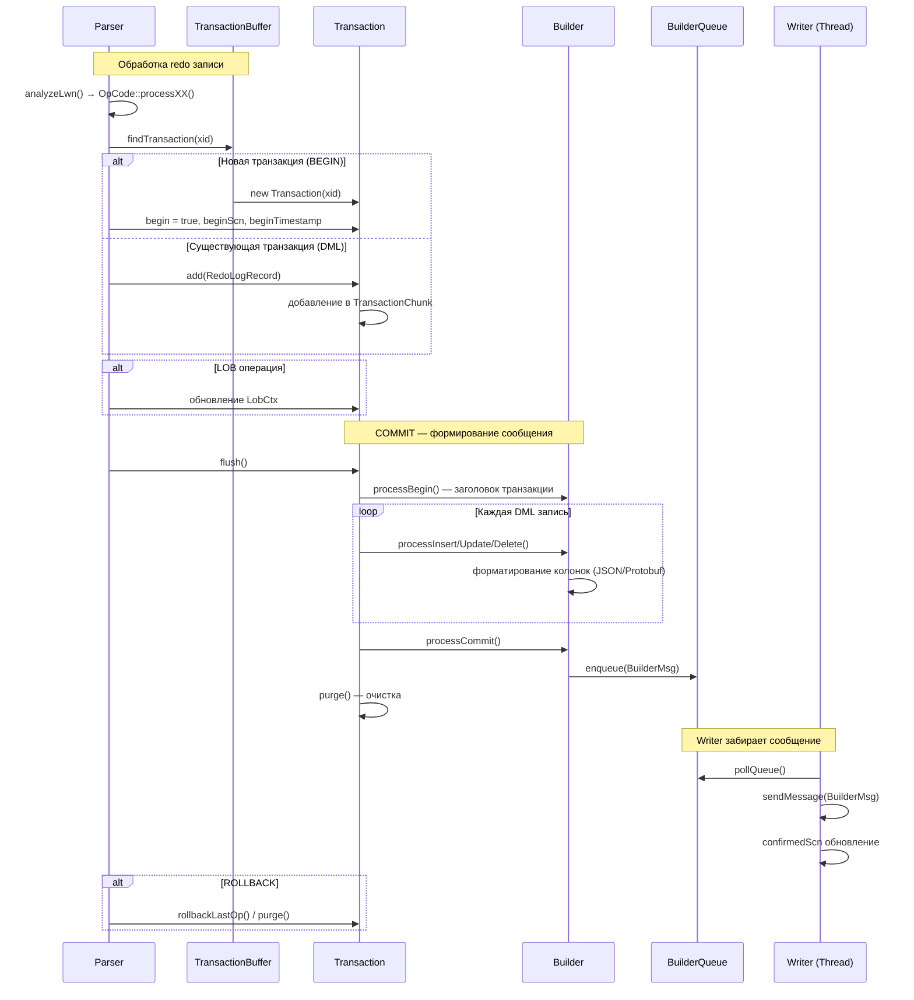
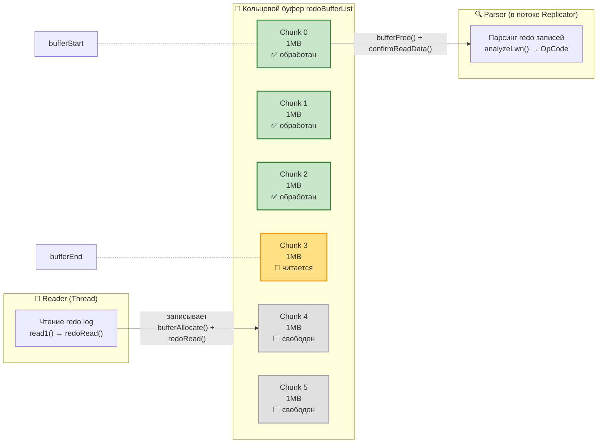
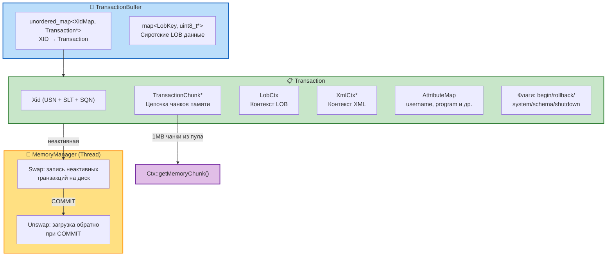
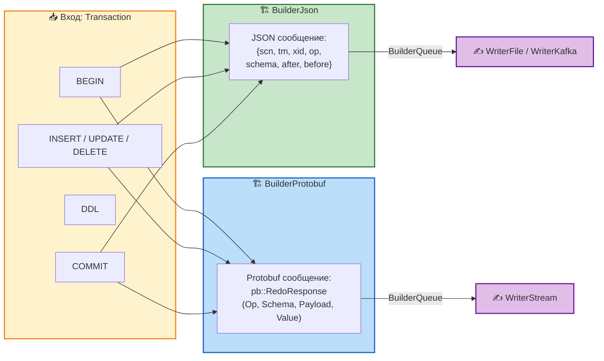
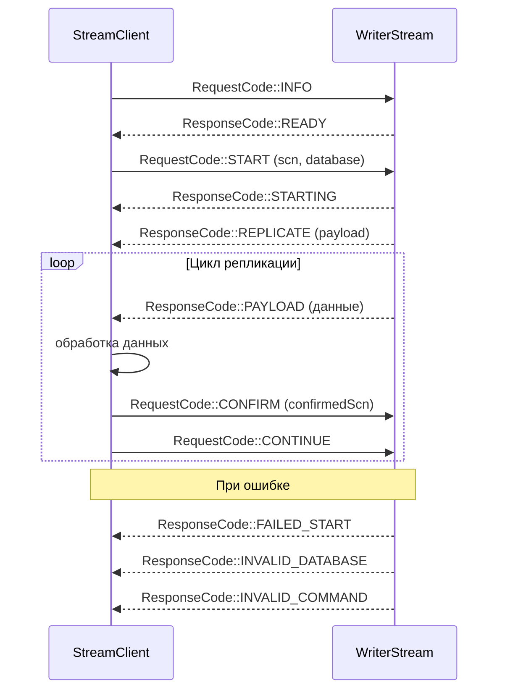

# Потоки данных OpenLogReplicator

## Основной поток данных (end-to-end)

```mermaid
flowchart LR
    subgraph Sources["📥 Источники данных"]
        FS["💾 Файловая система<br/>Архивные / Online логи"]
        ASM["🗃️ Oracle ASM<br/>dbms_diskgroup"]
        ASMBlockDevice["🔌 Блочные устройства<br/>/dev/sdX + extent map"]
    end

    subgraph ReaderLayer["📖 Reader (Thread)"]
        R["Reader<br/>Чтение блоков redo log<br/>в кольцевой буфер"]
    end

    subgraph ParserLayer["🔍 Parser (в потоке Replicator)"]
        P["Parser<br/>Парсинг бинарных записей"]
        LWN["LWN (Log Write Number)<br/>Группировка и сортировка<br/>записей по SCN"]
        OC["OpCode обработчики<br/>0501: Undo 0504: Commit<br/>0B02: INSERT 0B04: UPDATE<br/>0B03: DELETE 0513: DDL"]
    end

    subgraph TxnLayer["💾 Транзакционный слой"]
        TB["TransactionBuffer<br/>Активные транзакции<br/>map Xid → Transaction"]
        TXN["Transaction<br/>Накопление redo записей<br/>до COMMIT/ROLLBACK"]
    end

    subgraph BuilderLayer["🏗️ Builder"]
        B["Builder<br/>Формирование выходного<br/>сообщения из транзакции"]
        BQ["BuilderQueue<br/>Очередь сообщений<br/>для Writer"]
    end

    subgraph WriterLayer["✍️ Writer (Thread)"]
        W["Writer<br/>Отправка сообщения"]
    end

    subgraph Outputs["📤 Выходы"]
        File["📄 Файл / stdout"]
        Kafka["🚀 Apache Kafka"]
        TCP["🌐 TCP стрим"]
        ZMQ["⚡ ZeroMQ"]
    end

    FS --> R
    ASM --> R
    ASMBlockDevice --> R
    R -->|" redoBufferList<br/>блоки по blockSize "| P
    P --> LWN
    LWN --> OC
    OC -->|appendToTransaction| TB
    TB --> TXN
    TXN -->|" flush() при COMMIT "| B
    B -->|BuilderMsg| BQ
    BQ -->|pollQueue| W
    W --> File
    W --> Kafka
    W --> TCP
    W --> ZMQ

    classDef sources fill:#fff3cd,stroke:#f57f17,stroke-width:2px
    classDef reader fill:#bbdefb,stroke:#1565c0,stroke-width:2px
    classDef parser fill:#c8e6c9,stroke:#2e7d32,stroke-width:2px
    classDef txn fill:#e1bee7,stroke:#6a1b9a,stroke-width:2px
    classDef builder fill:#ffe082,stroke:#ff8f00,stroke-width:2px
    classDef writer fill:#ffcc80,stroke:#ef6c00,stroke-width:2px
    classDef outputs fill:#b2dfdb,stroke:#00695c,stroke-width:2px

    class Sources,Sources sources
    class ReaderLayer,ReaderLayer reader
    class ParserLayer,ParserLayer parser
    class TxnLayer,TxnLayer txn
    class BuilderLayer,BuilderLayer builder
    class WriterLayer,WriterLayer writer
    class Outputs,Outputs outputs
```

## Детальный поток: Reader → Parser

## Детальный поток: Parser → Builder → Writer

## Кольцевой буфер Reader

Reader и Parser работают через кольцевой буфер — набор чанков по 1MB. Reader заполняет чанки данными из redo log, Parser забирает обработанные. Когда буфер полон — Reader ждёт. Когда пуст — Parser ждёт.

**Указатели:**
- `bufferStart` — позиция в redo log, до которой Parser уже обработал все данные. Parser двигает вперёд через `confirmReadData()`
- `bufferEnd` — позиция, до которой Reader уже прочитал данные из файла. Reader двигает вперёд после каждого `read1()`
- `bufferSizeMax` = memoryChunksReadBufferMax × 1MB — общий размер буфера

**Синхронизация (один mutex):**
- `condReaderSleeping` — Replicator/Parser будит Reader, когда нужна новая команда
- `condParserSleeping` — Reader будит Parser, когда записал новые данные
- `condBufferFull` — Parser будит Reader, когда освободил чанк (буфер был полон)

**Жизненный цикл чанка:**
1. ⬜ **Свободен** — чанк в пуле, Reader может запросить через `bufferAllocate()`
2. 📝 **Читается** — Reader вызвал `redoRead()`, заполняет данными, затем `bufferEnd += goodBlocks`
3. ✅ **Готов** — данные записаны, Parser может читать из этого чанка
4. 🗑️ **Освобождён** — Parser вызвал `bufferFree()`, чанк вернулся в пул

## Схема памяти транзакций

## Форматы вывода Builder

## Протокол WriterStream (клиент-сервер)

